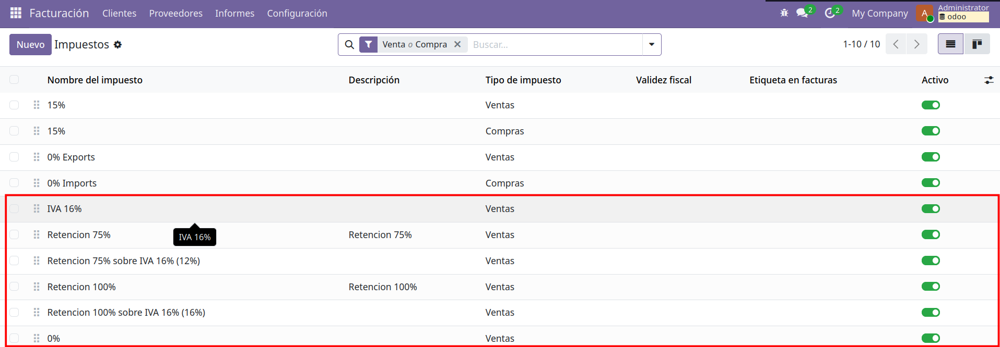
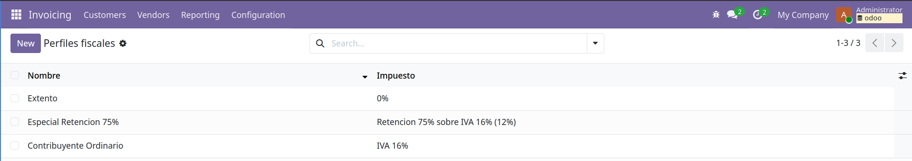
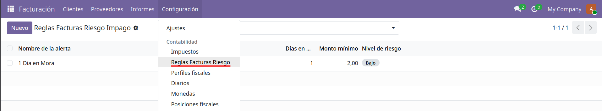
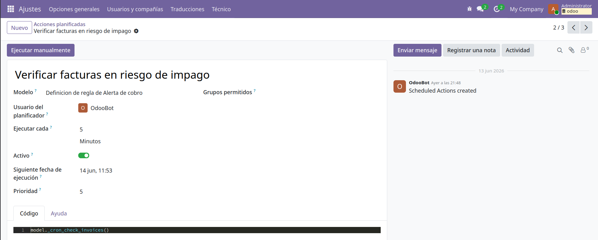
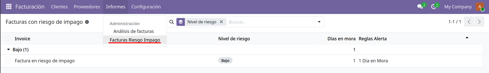

Este modulo tiene el código relacionado a los ejercicios de Contabilidad.

# Contabilidad: Retenciones Automáticas por Perfil Fiscal 

Documentación de Odoo Relacionada: 
- [Withholding taxes — Odoo 19.0 documentation](https://www.odoo.com/documentation/19.0/applications/finance/accounting/taxes/retention.html)

Para este ejercicio se definieron varios impuestos pre-configurados que existen en Venezuela en `src/custom/binaural_accounting/data/account_data_tax.xml`:

- El IVA de 16%
- Retenciones de 75% y 100% para Agente de retención o Contribuyente Especial.

 

Para los contribuyentes exentos se require crear un impuesto de 0%.

Antes de probar los flujos implementados se require de 

1. La configuración de la compañía por defecto de Odoo. En Ajustes -> Facturación poner país fiscal Venezuela
2. Crear perfiles fiscales Facturación -> Configuración -> Perfiles fiscales.
 
3. Crear Clientes y asignarles Perfiles Fiscales. Facturación -> Clientes -> Clientes.
4. Cree un producto.
5. Diríjase a la vista de Facturación -> Clientes -> Facturas de Cliente. Cree una factura
6. Seleccione un cliente.
7. Cree una línea de factura. 

Dependiendo del tipo de cliente seleccionado, se aplica el impuestos o retención del perfil fiscal relacionado en la línea de la factura.

# Contabilidad: Alertas de Facturas con Riesgo de Cobro 

1. Defina una regla de riesgo de impago en Facturación -> Configuración -> Reglas Factura Riesgo. 
    - Poner Días en mora 1.
    - Monto mínimo 2.
2. En Facturación -> Clientes -> Facturas de Cliente. Cree una factura con fecha de factura de hace un mes y fecha de vencimiento de un día después.
 
3. Espere 5 minutos a que se ejecute el cronjob de evaluación de facturas en riesgo de impago.

4. Diríjase a Facturación -> Informes -> Facturas Riesgo Impago. Observe si se ha creado una linea que diga que hay una factura en riesgo de impago.
 

