# Inventario: Reglas de Reabastecimiento por Prioridad

1. Cree o edite un producto Inventario -> Productos -> Productos.

2. En la pestaña de Información general Asigne un "Stock objetivo" y "Prioridad de Reabastecimiento".
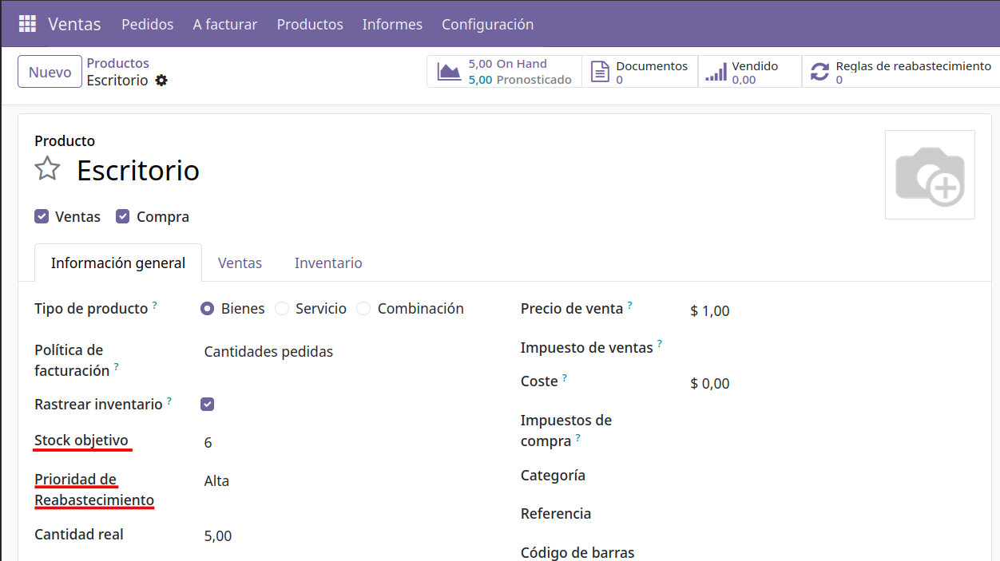 

3. Espere 5 minutos a que se ejecute el cronjob de "Verificar existencia de Productos a reabastecer". O ejecútelo manualmente.
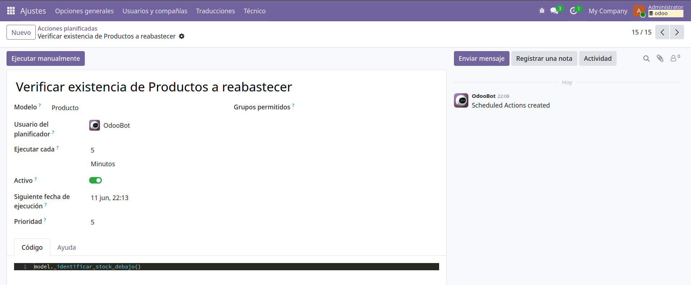 

4. Visite la vista lista de "Pendientes de reabastecimiento" ->
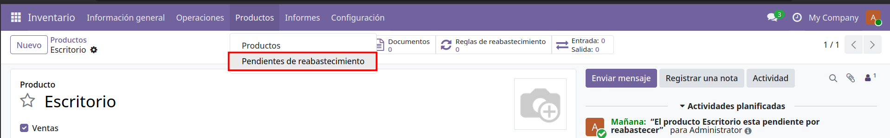 

5. Verifique que se ha creado una nueva entrada
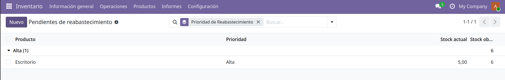 

6. Verifique que se ha creado una nueva actividad planificada para el responsable del almacén.

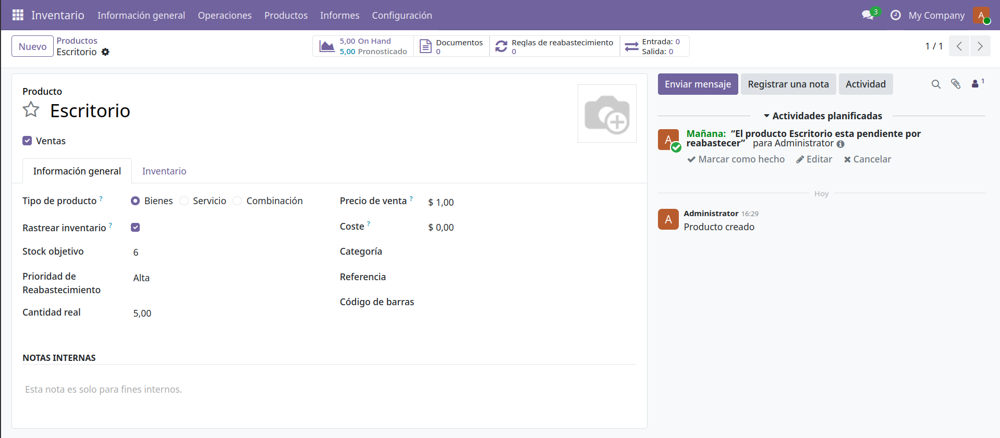

## Notas técnicas
El responsable del almacén es el usuario encargado del almacén en donde esta guardado el producto. Si no se encuentra, el administrador será el responsable.
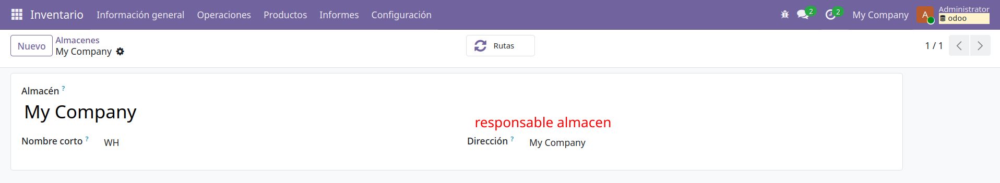 

# Inventario: Clasificación Operativa de Productos

1. Cree etiquetas en Inventario -> Configuración -> Etiquetas Producto.
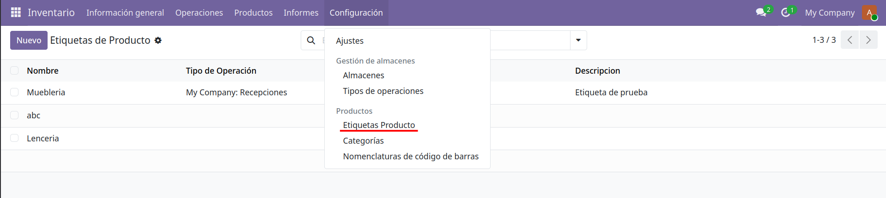 

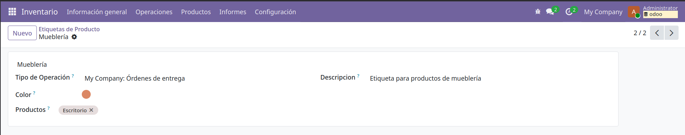
2. Asigne las a productos. Inventario -> Productos -> Productos.
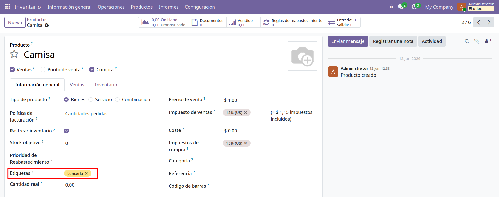

. Diríjase a la vista de "Operativa de productos" en Inventario -> Productos -> Operativa de productos.
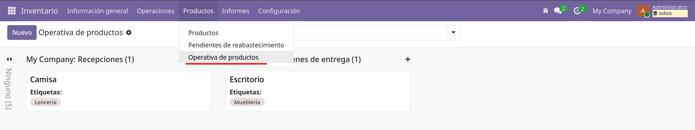
. Puede agrupar por tipo de operación o etiquetas. Por defecto se agrupa por tipo de operación.
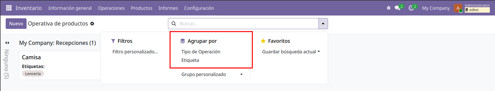 

