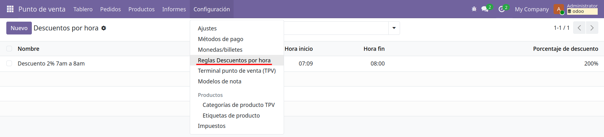

Este modulo contiene el código del ejercicio de punto de venta.

# Punto de Venta: Reglas de Descuento por Horario
Se require tener instalada la aplicación de punto de venta `point_of_sale` y productos relacionados con el punto de venta (casilla de "Punto de venta marcada").

1. Cree una regla de descuento por hora. Diríjase a Punto de Venta -> Reglas Descuentos por hora.
 

2. Diríjase a la vista de punto de venta, abra una nueva sesión. Dependiendo de la hora que eligió debería de aplicarse automáticamente el descuento al añadir el producto en el punto de venta.

# Detalles técnicos de implementación
Para aplicar los descuentos de manera automática se tuvo que sobrescribir el componente OWL de `OrderSummary` y el servicio `PosStore` que gestiona el esta del Punto de Venta. Ver fichero js `src/custom/binaural_pos/static/src/app/screens/product_screen/order_summary/order_summary.js`
